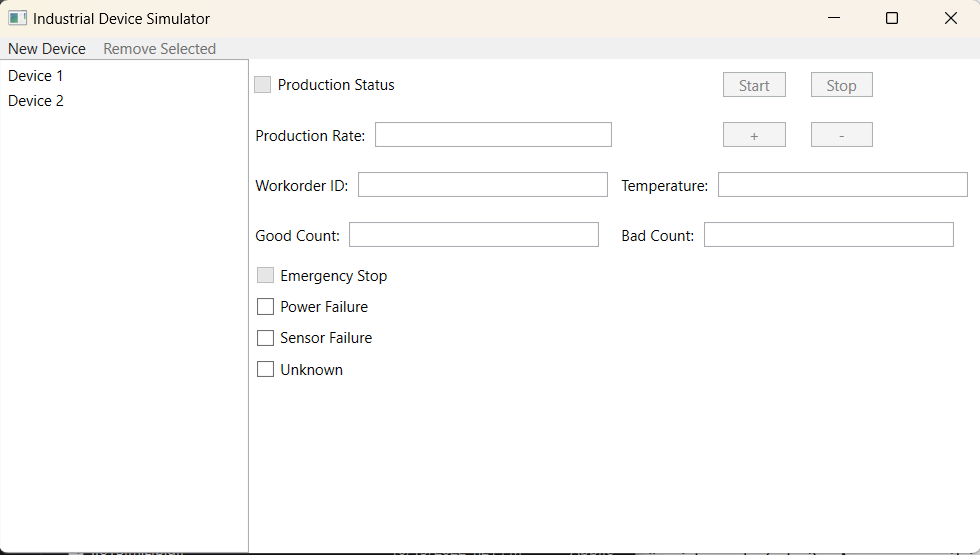
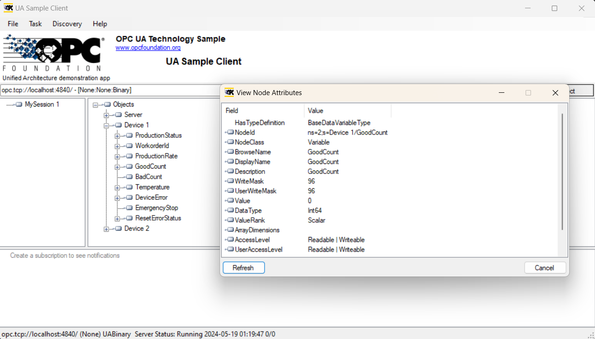

# OPC SETUP FOR LOCAL DEVELOPMENT

This section explains how to set up a simulated OPC server for testing and development purposes when running your application locally.

## IIoTSim

For running our application we need to simulate our OPC server. For doing we can use app from `IIoTSim`. Program propose simple interface for adding, removing and controlling devices;

> Windows-Specific Simulation

To connect to this local server we can use this connection string

`opc.tcp://localhost:4840/`

## UA Simple Client

To overview all OPC devices and their Data and Method Nodes we can use program `UA Simple Client`.

