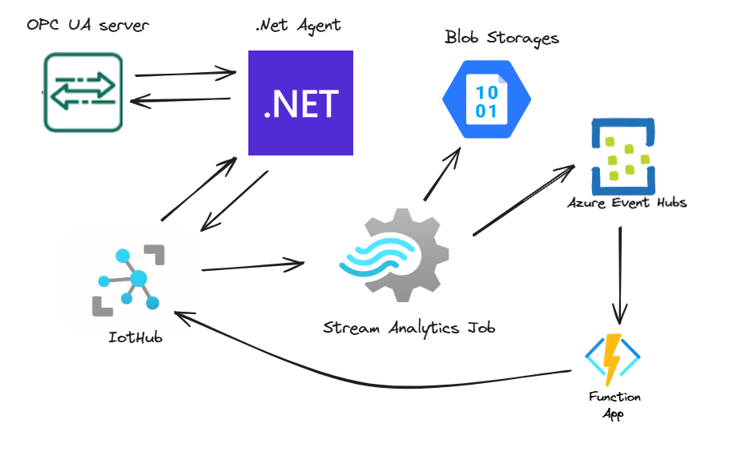

# Industrialiot

This project aims to control and analyze OPC UA devices using Azure products. The integration involves using Azure IoT Hub for device communication, Azure Device Twin for device state management, Azure Stream Analytics for data processing and insights, and Azure Function App for actions.

> Scheme of all application

## Main parts

- OPC Server [(local development guide)](https://github.com/Yaroslaw07/Industrialiot/tree/master/Industrialiot.Opc)

- [Agent (c#, .net)](https://github.com/Yaroslaw07/Industrialiot/tree/master/Industrialiot.Agent)

- Azure IotHub

- [Stream Analytics Job](https://github.com/Yaroslaw07/Industrialiot/tree/master/Industrialiot.StreamAnalytics)

- Blobs and Event hub

- [Azure Function app](https://github.com/Yaroslaw07/Industrialiot/tree/master/Industrialiot.Functions)
